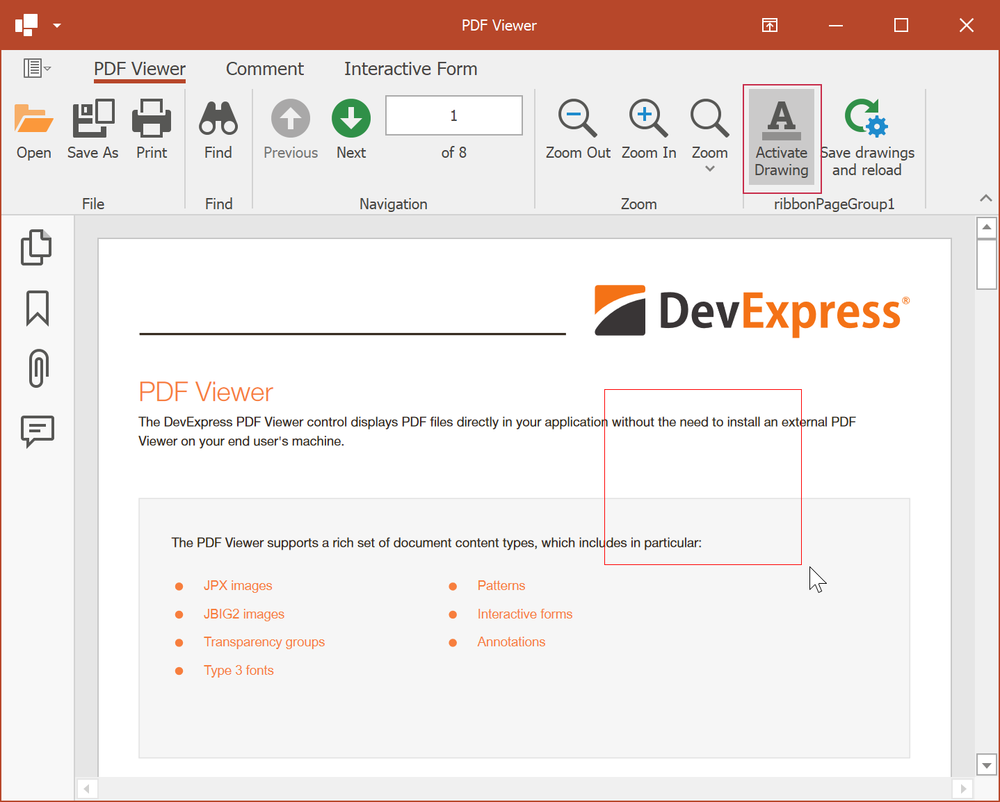

<!-- default badges list -->

<!-- default badges end -->
<!-- default file list -->
*Files to look at*:

* [Form1.cs](./CS/PDF%Viewer/Form1.cs) (VB: [Form1.vb](./VB/PDF%Viewer/Form1.vb))
<!-- default file list end -->
# How to: Draw Graphics by Coordinates Obtained from the PDF Viewer

The [PDF Viewer](https://www.devexpress.com/products/net/controls/winforms/pdf-viewer/) allows you to draw graphics in a PDF file in the [Control.Paint](https://docs.microsoft.com/en-us/dotnet/api/system.windows.forms.control.paint) event handler. Use the [PDF Graphics API](https://docs.devexpress.com/OfficeFileAPI/119009/pdf-document-api/pdf-graphics) to save graphics to a file.

> **IMPORTANT**
> You need a license for the DevExpress [Office File API Subscription](https://www.devexpress.com/products/net/office-file-api/) or [DevExpress Universal Subscription](https://www.devexpress.com/subscriptions/universal.xml) to use PDF Graphics API in production code.

In this example, a rectangle is drawn in the selection area. Drawing is activated on the **Activate Drawing** button click. The **Save Graphics and Reload** button saves created graphics and reloads the PDF file.

Refer to the following article for more information:

[How to: Draw Graphics by Coordinates Obtained from the PDF Viewer](https://docs.devexpress.com/WindowsForms/115318/controls-and-libraries/pdf-viewer/examples/interactivity/how-to-custom-draw-in-the-pdf-viewer)
